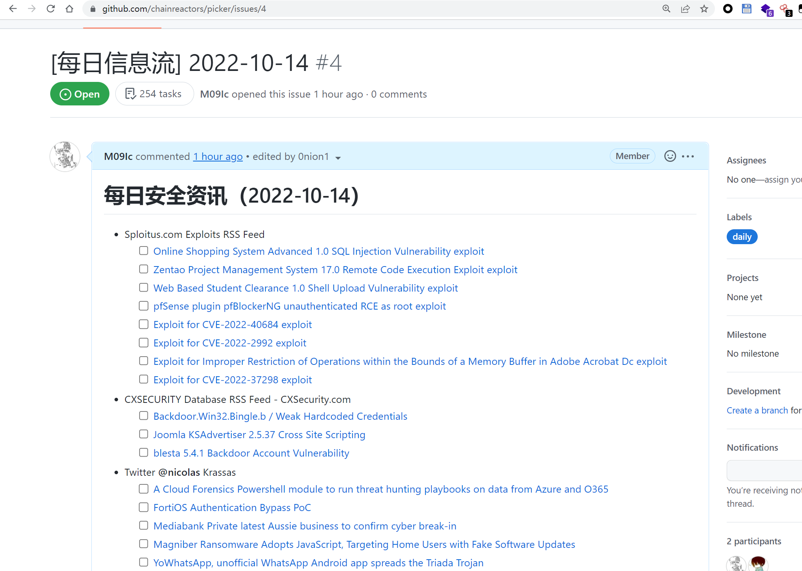
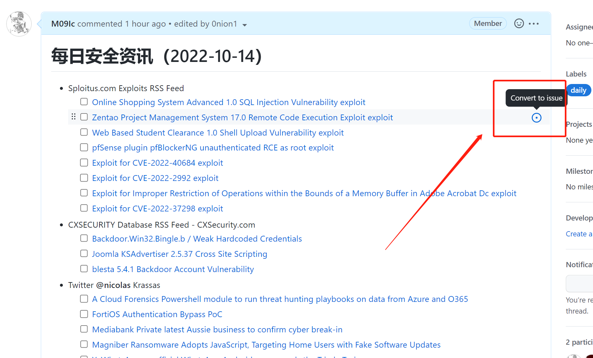
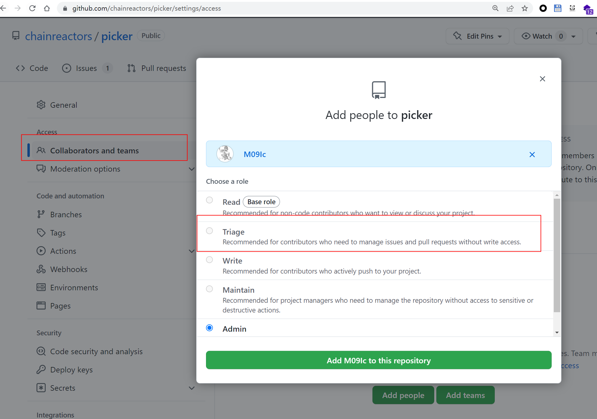
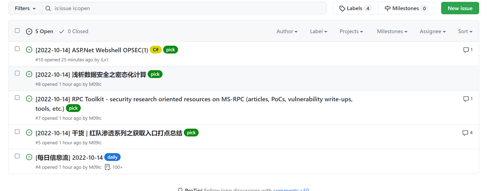

# picker

[](#environment)
[](#deployment-with-github-actions)
[](LICENSE)

`picker` 是一个面向安全资讯场景的 RSS 抓取与推送工具。它基于 GitHub Actions 自动生成每日信息流、每日精选和精选评论推送，也支持导入自定义 OPML 订阅源。

## Table of Contents
- [What it does](#what-it-does)
- [Push workflows](#push-workflows)
- [Repository layout](#repository-layout)
- [Quick start](#quick-start)
- [Configure feeds](#configure-feeds)
- [Deployment with GitHub Actions](#deployment-with-github-actions)
- [Local run](#local-run)
- [Screenshots](#screenshots)
- [Recommended feed sources](#recommended-feed-sources)

## What it does

- 聚合安全 RSS 与其他 OPML 订阅源
- 每天自动生成昨日新增文章信息流
- 支持把优质文章转成精选并二次推送
- 支持精选文章评论推送到钉钉群
- 通过标签管理 daily、dailypick、pick 等不同内容流

## Push workflows

1. **每日信息流**，默认每天 09:30 推送昨日新增文章列表。
2. **每日精选**，默认每天 13:30 汇总昨日精选内容。
3. **精选推送**，在生成的 issue 中点击 convert to issue，可把内容加入精选推送链路。
4. **评论推送**，精选文章收到评论时自动同步到钉钉。

## Repository layout

- `bot.py`，消息推送入口
- `utils.py`，抓取与辅助逻辑
- `yarb.py`，调度与任务执行
- `rss/`，OPML 订阅源
- `img/`，README 示例截图
- `install.sh`，本地安装脚本
- `config.yml`，部署配置样例

## Quick start

### Environment

- Python 3.10+
- GitHub CLI（本地运行时）
- 可选代理，用于提升外部 RSS 拉取稳定性

### Install

```bash
git clone https://github.com/Tyaoo/picker.git
cd picker
./install.sh
```

### Run once

```bash
python bot.py --help
python bot.py
```

## Configure feeds

在配置文件里启用本地或远程订阅源，例如：

```yaml
rss:
  CustomRSS:
    enabled: true
    filename: CustomRSS.opml
  CyberSecurityRSS:
    enabled: true
    url: https://raw.githubusercontent.com/zer0yu/CyberSecurityRSS/master/CyberSecurityRSS.opml
    filename: CyberSecurityRSS.opml
```

- 自定义 RSS 源可以放在 `rss/CustomRSS.opml`
- 非 RSS 站点可以通过 RSSHub 转发接入
- 如需共享新源，提交 PR 后可加入默认推送列表

## Deployment with GitHub Actions

推荐通过 GitHub Actions 部署。

1. 不建议直接在 fork 上运行，最好 clone 后推到自己的空仓库。
2. 预先创建 `daily` 和 `dailypick` 标签。
3. 在仓库 Secrets 中配置：
   - `MY_GITHUB_TOKEN`
   - `DINGTALK_KEY`
   - `DINGTALK_SECRET`
   - `PICKER_DINGTALK_KEY`
   - `PICKER_DINGTALK_SECRET`
4. 当前支持钉钉机器人推送，建议使用加签模式。

如果只配置一套钉钉密钥，全部消息会走同一个机器人。

## Local run

本地模式适合调试订阅源和机器人配置。

```bash
python bot.py --update
python bot.py --cron "11:00"
python bot.py --test
```

常用参数：

- `--update`，更新 RSS 配置
- `--cron`，按指定时间执行每日任务
- `--config`，使用自定义配置文件
- `--test`，验证机器人配置

## Screenshots

### 信息流


### 精选


### 权限


### 标签


## Recommended feed sources

安全类：

- [CustomRSS](rss/CustomRSS.opml)
- [CyberSecurityRSS](https://github.com/zer0yu/CyberSecurityRSS)
- [Chinese-Security-RSS](https://github.com/zhengjim/Chinese-Security-RSS)
- [awesome-security-feed](https://github.com/mrtouch93/awesome-security-feed)
- [SecurityRSS](https://github.com/Han0nly/SecurityRSS)
- [安全技术公众号](https://github.com/ttttmr/wechat2rss)
- [SecWiki 安全聚合](https://www.sec-wiki.com/opml/index)
- [Hacking8 安全信息流](https://i.hacking8.com/)

非安全类：

- [中文独立博客列表](https://github.com/timqian/chinese-independent-blogs)

## License

Released under the [MIT License](LICENSE).
