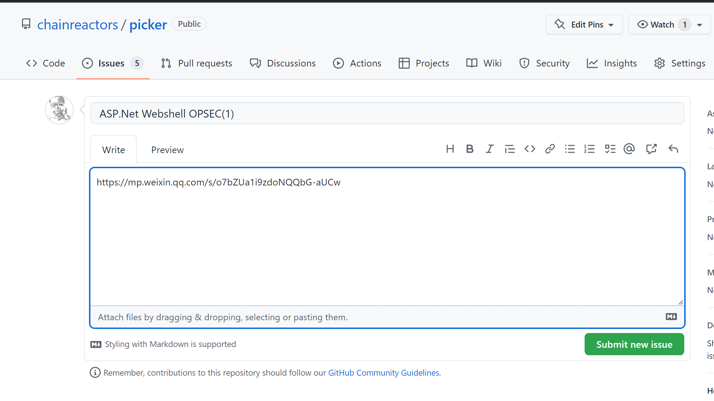

# picker

[](#本地运行)
[](#部署方式)
[](LICENSE)

一个面向安全资讯场景的 RSS 聚合、筛选、Issue 协作与钉钉推送工具。支持导入 OPML，也可以扩展成其他主题的信息流系统。

## 目录

- [这个项目能做什么](#这个项目能做什么)
- [核心能力](#核心能力)
- [使用流程](#使用流程)
- [部署方式](#部署方式)
- [本地运行](#本地运行)
- [订阅源配置](#订阅源配置)
- [项目结构](#项目结构)

## 这个项目能做什么

`picker` 把“抓取 RSS → 生成每日信息流 → 人工挑选精选 → 推送到群”的流程串起来，适合安全团队、情报团队或任何需要做日更资讯整理的场景。

## 核心能力

- **每日信息流**：每天自动生成昨日新增文章列表
- **每日精选**：把人工标记的优质内容汇总后定时推送
- **Issue 协作**：通过 GitHub Issue/评论完成筛选与编辑
- **钉钉通知**：支持每日推送与精选评论推送
- **OPML 导入**：内置多个安全 RSS 源，也支持自定义订阅源

## 使用流程

### 1. 每日信息流

每天会自动生成一条 Issue，用于汇总昨日新增文章。


### 2. 标记精选

如果某篇文章值得推荐，可以通过 `Convert to issue` 或手动新建 Issue 的方式加入精选列表。


多人协作时，执行 `Convert to issue` 需要相应权限。


也可以手动创建新 Issue，系统会自动纳入处理流程。



### 3. 标签管理

- `daily`：每日信息流
- `dailypick`：每日精选汇总
- `pick`：精选文章

还可以继续增加细分标签管理不同方向的内容。


### 4. 评论推送

对精选文章的评论会自动同步推送到钉钉群，方便团队补充观点或上下文。

## 部署方式

### GitHub Actions 部署

仓库已经带好工作流，适合直接跑定时任务。

部署前需要准备：

1. 新建自己的仓库（原 README 里也提到，建议不要直接保留 fork 关系）
2. 提前创建标签：`daily`、`dailypick`
3. 在仓库 Secrets 中配置 `MY_GITHUB_TOKEN`
4. 如果要启用钉钉推送，再配置：
   - `DINGTALK_KEY`
   - `DINGTALK_SECRET`
   - `PICKER_DINGTALK_KEY`
   - `PICKER_DINGTALK_SECRET`

工作流会自动执行：

- 拉取与更新订阅源
- 生成每日文章汇总
- 创建对应 Issue
- 提交归档内容

## 本地运行

### 安装

```bash
git clone https://github.com/Tyaoo/picker.git
cd picker
python3 -m pip install -r requirements.txt
```

### 运行

```bash
python3 yarb.py
```

### 常用命令

```bash
python3 yarb.py --help
python3 yarb.py --update
python3 yarb.py --test
```

## 订阅源配置

推荐先从 `rss/CustomRSS.opml` 开始维护自己的订阅源。

项目已经内置多份安全 RSS，例如：

- `CyberSecurityRSS`
- `Chinese-Security-RSS`
- `awesome-security-feed`
- `wechatRSS`

如果需要扩展：

1. 在配置文件里新增 RSS 源
2. 把本地或远程 OPML 地址填进去
3. 对非 RSS 源使用 RSSHub 等方式中转

## 项目结构

```text
yarb.py             主流程入口
utils.py            通用工具函数
rss/                RSS / OPML 订阅源
archive/            历史归档内容
img/                README 截图
.github/workflows/  定时任务与自动化工作流
```
